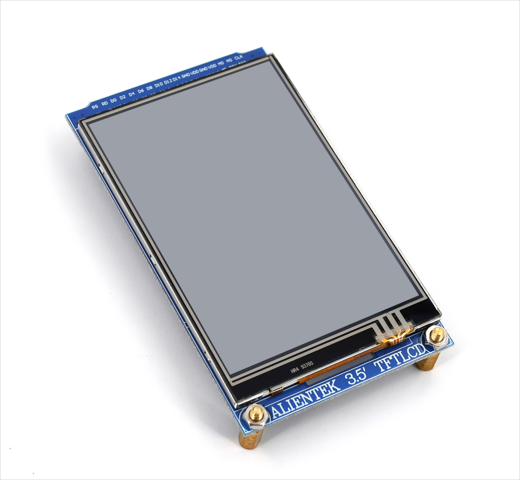
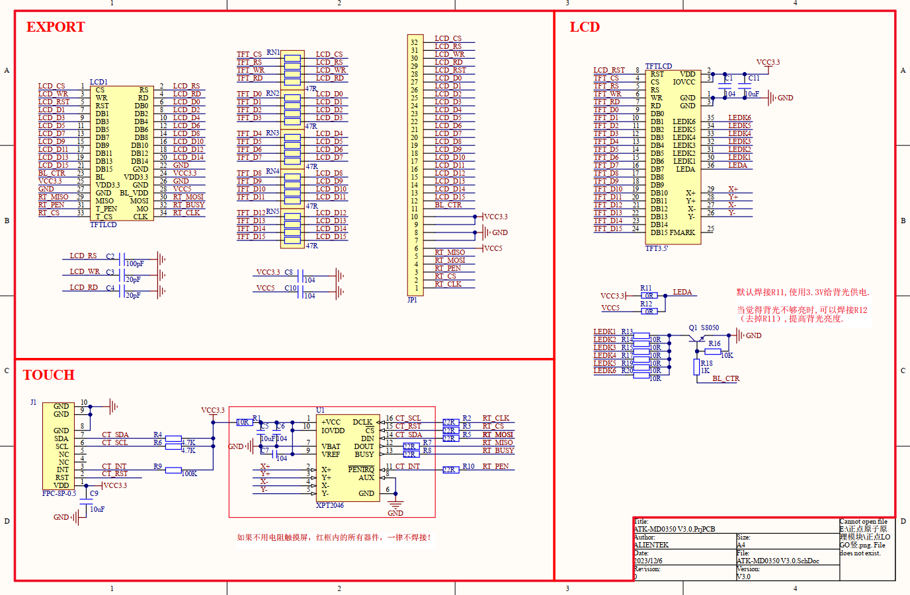

## 1 Introduction

### 1.1 Appearence

The ATK-MD0350 module looks like this:

### 1.2 Features

The ATK-MD0350 module is a high-performance 3.5-inch TFT LCD resistive touchscreen module launched by ALIENTEK. The module has an LCD resolution of 320*480 pixels, supports 16-bit true color display, and uses ILI9341/ST7789 as the LCD driver chip. This chip comes with its own RAM, eliminating the need for additional drivers or memory. As a result, most external controllers can easily drive the module. Additionally, the ATK-MD0350 module supports touch functionality, using a resistive touchscreen known for its high precision, strong anti-interference ability, and good stability. However, it does not support multi-touch.

### 1.3 Parameter

Here are the product basic parameters:

| Parameter                     | Describe                                                     |
| ----------------------------- | ------------------------------------------------------------ |
| Communication Interface       | LCD: Intel 8080-16 bit parallel port Touch: SPI          |
| Color Format                  | RGB565                                                       |
| Color Depth                   | 16-bit                                                       |
| Driver Chip                   | NT35310                                                      |        
| LCD Resolution                | 320*480                                                      |
| Screen Size                   | 3.5 inch                                                     |
| Touch screen type             | Resistive touch                                              |
| Resistive touch sampling chip | HR2046                                                       |
| Touch Point Count             | Single touch                                                 |
| Operating Temperature         | -20¡æ ~ 70¡æ                                                 |
| Storage Temperature           | -30¡æ ~ 80¡æ                                                 |
| Mudule Size                   | 56.4mm*97.4mm                                                |

The electrical parameters are shown in the following table:

| Parameter         | Describe                                                     |
| ----------------- | ------------------------------------------------------------ |
| Supply voltage    | LCD backlight: 5V   Other: 3.3V                         |
| IO port level     | 3.3V                                                         |
| Power dissipation | LCD backlight is off: 37mA Maximum brightness of LCD backlight: 119mA |

### 1.4 Interface

The ATK-MD0350 module is connected to the external circuit through a 32P FPC socket. The detailed description of each pin is shown in the table below.

| Number | Name  | Describe                                                    |
| ------ | ----- | ----------------------------------------------------------- |
| 1      | CLK   | Touch SPI communication clock signal                        |
| 2      | TCS   | Touch SPI communication chip selection signal (effective low level)         |
| 3      | PEN   | Touch interrupt signal (0: touch; 1: no touch)              |
| 4      | MO    | Touch SPI communication MOSI signal                         |
| 5      | MI    | Touch SPI communication MISO signal                         |
| 6      | V5    |LCD backlight power supply (5V)                              |
| 7,8    | GND   | Power ground                                                |
| 9,10   | VDD   | Main power supply (3.3V)                                    |
| 11     | BL    | LCD backlight control signal (0: turn off LCD backlight; 1: Turn on LCD backlight)   |
| 12~27  | D0~D15| BDB(bidirectional data bus)                                 |
| 28     | RST   | Reset signal (low level valid)                              |
| 29     | RD    | Read enable signal (valid at low level)                     |
| 30     | WR    | Write enable signal (valid at low level)                    |
| 31     | RS    | Command and data control signal (0: command; 1: Data)       |
| 32     | CS    | LCD chip selection signal (effective at low level)          |

## 2 Schematic

The schematic diagram of the ATK-MD0350 module is shown as follows.

